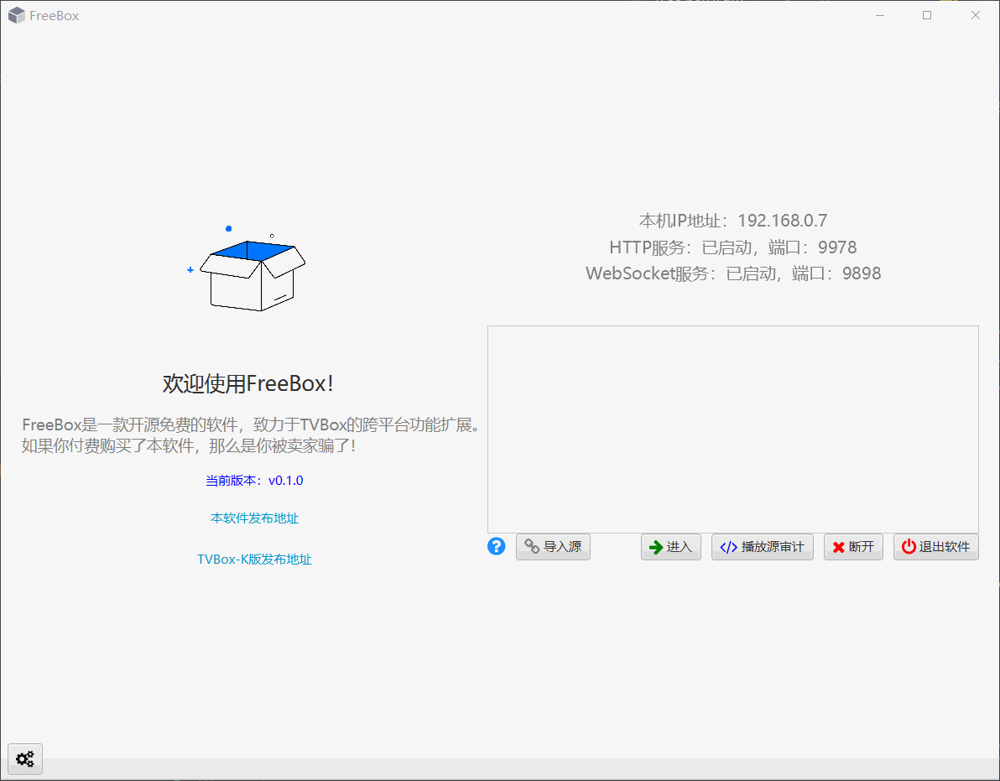
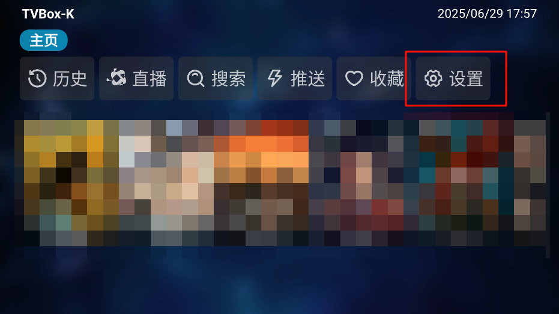
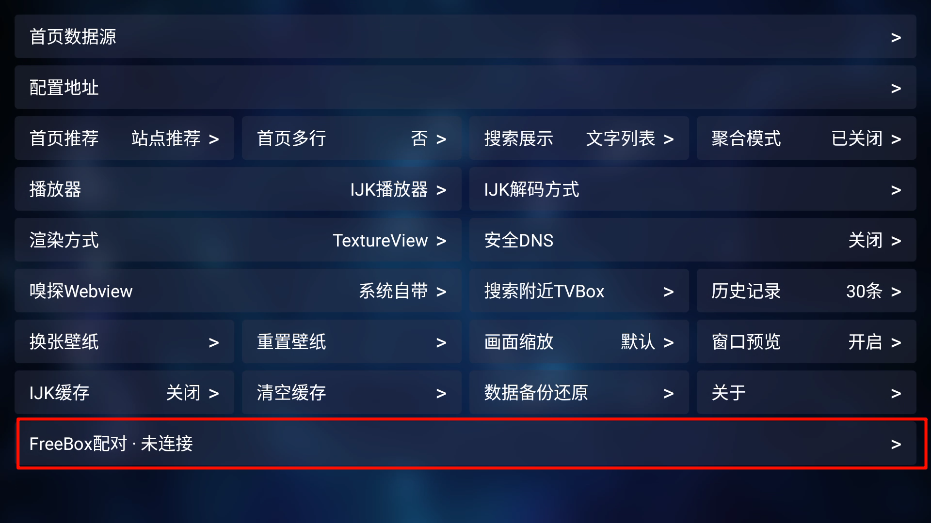
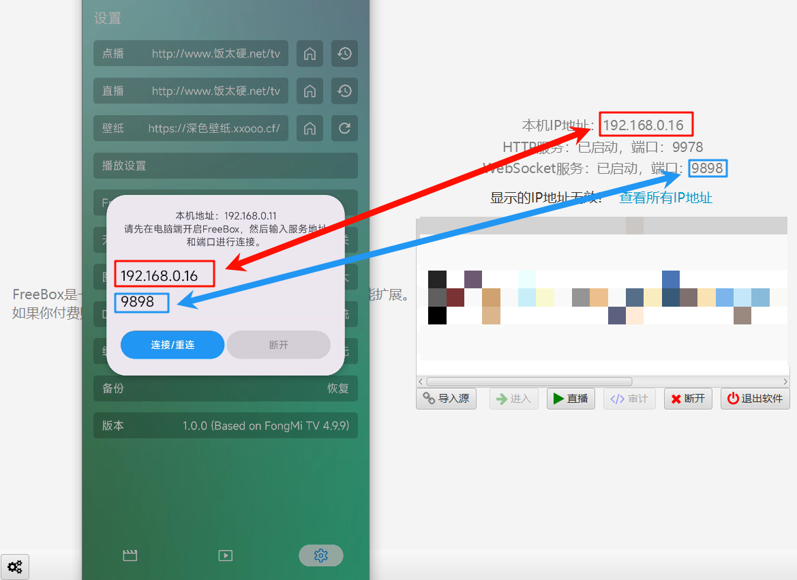
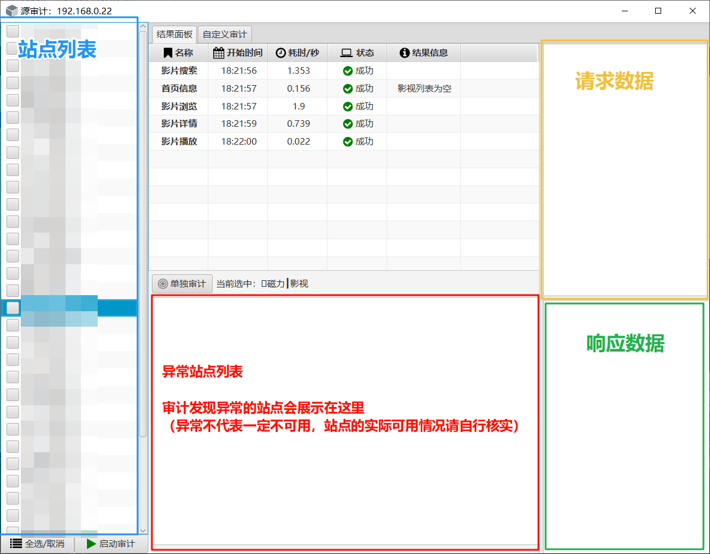
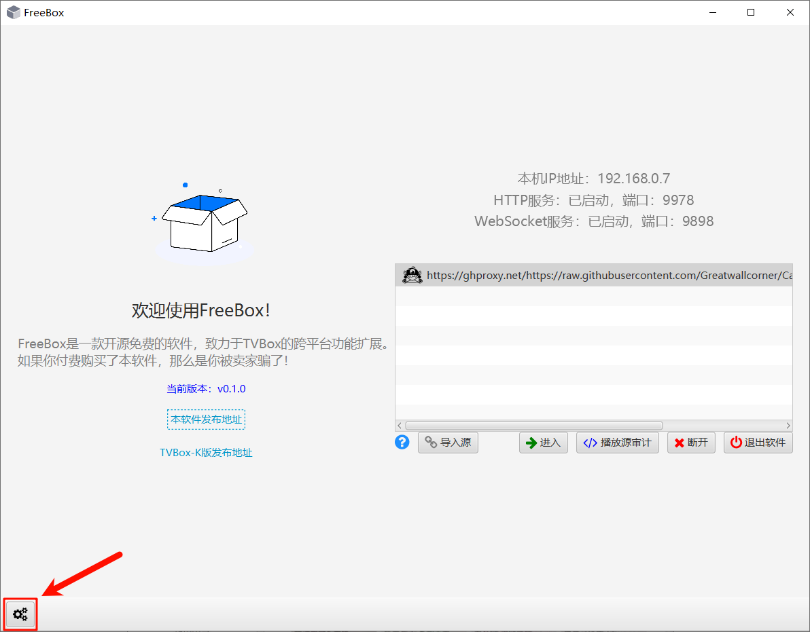
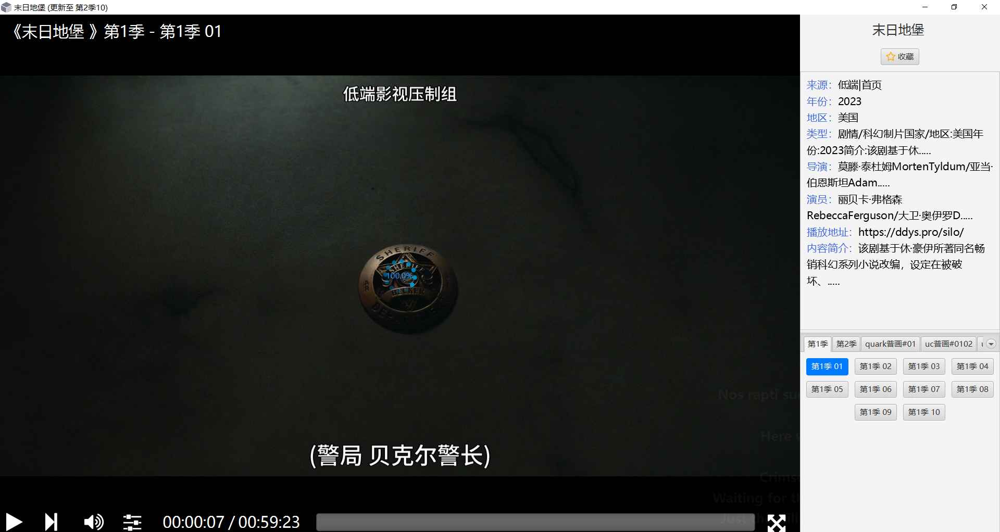

    

<h1 align="center">FreeBox</h1>

---

    
    
    

一个基于 JavaFX 开发的影视播放软件

## 一、介绍

FreeBox是一款集成了**影视播放**和**资源审计**功能的桌面端软件（目前仅支持Windows），具有如下特点：

- 小巧：软件安装包<50M，后续应该也不会特别膨胀了

- 易用：延续经典TVBox风味，配置简单直观

- 更新方便：作者将持续维护、发版，且软件的安装版支持自更新

- ~~开箱即用~~：前提是你安装一个[VLC播放器](https://www.videolan.org/vlc/)

只支持64位系统，推荐在Windows10或以上系统运行，Windows7理论可行，可以试试看

**本软件完全免费、开源，如果您下载或使用了本软件，视为您已阅读并同意本软件的[许可协议](https://sourceforge.net/p/freeboxk/main/ci/main/tree/src/main/resources/io/knifer/freebox/doc/license.txt?format=raw)，该许可协议也会在软件第一次打开时弹出**

软件基于猫影视规则，致力于TVBox生态的跨平台扩展。个人项目难免多有疏漏，欢迎讨论和PR，欢迎大家来玩~

---

## 二、快速开始

请看介绍视频：

<iframe src="//player.bilibili.com/player.html?isOutside=true&aid=114776407547579&bvid=BV1AXgmzUENg&cid=30787832618&p=1" scrolling="no" border="0" frameborder="no" framespacing="0" allowfullscreen="true"></iframe>

### 1. 下载

**推荐使用安装版（msi安装包），便于接收软件的自动更新**

点击下载最新版👇

### 2. TVBox-K下载

**如果您下载或使用了TVBox-K软件，视为您已阅读并同意TVBox-K软件的[免责声明](https://github.com/kknifer7/TVBoxOS-K/raw/refs/heads/main/doc/%E5%85%8D%E8%B4%A3%E5%A3%B0%E6%98%8E.txt)**

TVBox-K项目地址👇

[GitHub - kknifer7/TVBoxOS-K](https://github.com/kknifer7/TVBoxOS-K)

TVBox-K下载👇

[蓝奏云 - 密码：5zyo](https://wwzj.lanzoul.com/b0138xz5bi)

### 3. 安装VLC播放器

软件会自动检测你的电脑上是否安装了VLC播放器，如果软件在首页提示你“未安装VLC播放器”，请点击软件中的蓝色提示，到 [VLC播放器官网](https://www.videolan.org/vlc/) 去下载安装

---

## 三、主要功能

### 1. 播放源支持

软件目前支持**导入源**和**TVBox源**两种，其中：

- 导入源：是指将接口链接直接配置进本软件，只支持Java格式的Spider（type=3），其他类型的Spider后续将按需考虑支持。

- TVBox源：为了**缓解**PC端不能播放安卓端接口的问题，以及为实现后续更多的功能（如弹幕、放映厅、异地多端同步播放等），本软件可以与特定的[TVBox-K](https://github.com/kknifer7/TVBoxOS-K)项目一起使用，实现用PC端来播放安卓端资源。

- 关于TVBox源的更多解释：总的来说，**目前阶段如果你希望在PC端播放安卓端的资源，本软件可以帮你省去在电脑上使用手机模拟器的过程，你只需要在同网络环境下的手机/电视盒子的后台挂一个TVBox来连接本软件即可**

#### 1.1 导入源

如下图操作：

导入的源会一直保存在软件中，无需重复导入

图中导入的源地址：

- https://ghproxy.net/https://raw.githubusercontent.com/Greatwallcorner/CatVodSpider/master/json/config.json

- 来自于 [Greatwallcorner/CatVodSpider](https://github.com/Greatwallcorner/CatVodSpider) ，是其他作者的项目，不由本人维护，仅作演示使用，感谢大佬的付出

#### 1.2 TVBox源

使用方式：

1. 在 TVBox-K App 中进入“设置”
   
   

2. 进入“FreeBox配对”
   
   

3. 在下方输入框中输入FreeBox主界面显示的的IP和端口
   
   **请仔细查看，相同颜色的框中的内容要一一对应**
   
   

4. 点击下面的“连接/重连”按钮，连接成功后TVBox-K中弹出提示，FreeBox也会收到通知

### 2. 源审计

本功能面向的用户类型：

- 源接口的维护者

- Spider的开发者

- 想知道一个源中哪些站点可用，哪些站点不可用，看一看请求数据的好奇用户

连接到源后，软件可以自动化审计源中的站点下的各个功能，获取请求和响应数据，以此判断站点是否可用，软件会筛选出不可用的站点，同时给出对应原因，以供用户来排查

使用方式：

1. 在首页源列表中单击选中你想审计的源

2. 点击列表下方的“播放源审计”，进入审计窗口

3. 左侧列表中会列出源中的所有站点，可以进行审计操作
   
   - 批量审计：在左侧列表中勾选你想审计的站点，然后点击下方的“启动审计”
   
   - 单独审计：在左侧列表中单击你想审计的站点，然后点击中央窗口的“单独审计”

这里其他的东西可以自行摸索：

### 3. 软件设置

打开设置：

网络设置：一般无需更改，如果你知道自己在做什么，请随意

常规设置：可自行探索

### 4. 影视点播

在首页的源列表中单击选中一个源后，点击“进入”即可进入影视点播界面，点击“断开”即可移除该源

影视点播界面的操作逻辑与tvbox完全一致

功能示意图：

对于TVBox源：播放记录、播放进度、收藏等数据，与手机app完全互通

对于导入源：上述的数据会独立保存，可以在设置中进行清理

### 5. 其他说明

关于**自更新**：软件的安装版支持自更新，免安装版也可以使用自更新，但下载到的是安装包

---

## 四、后续开发计划🎯

| **功能**                           | **优先级** | **备注**                                                                     |
|:--------------------------------:|:-------:|:--------------------------------------------------------------------------:|
| 影片离线缓存                           | 高       | -                                                                          |
| 直播源、部分特殊源支持                      | 高       | -                                                                          |
| 在线放映室                            | 中       | 提供功能扩展，让软件连接到后端服务，实现**线上放映室**的功能（用户可以创建房间，分享影片，与线上的其他人同步观看，进行弹幕聊天等）        |
| 更多针对**影视源作者**和**Spider开发者**的功能支持 | 中       | 目前阶段，会优先完善“源审计”模块中的“自定义审计”功能                                               |
| 界面样式优化                           | 低       | 低优先级，目前作者只着重功能上的开发，界面都是框架的默认样式。如果你擅长CSS，对本项目感兴趣，也非常欢迎你跟作者一起探讨界面美化方案和贡献代码😘 |

如果你有功能建议，或者遇到了BUG，欢迎过来讨论和提问

作者不维护线上群组，你可以：

- 在 [这里](https://github.com/kknifer7/FreeBox/issues/new) 提Issue

- 联系我的邮箱：[knifer@duck.com](mailto:knifer@duck.com)

---

## 杂项

### 1. 软件界面截图

影视播放：

### 2. 许可协议

FreeBox软件许可协议：

本软件基于 [GPL-3.0 license](https://www.gnu.org/licenses/gpl-3.0.html) 许可证发行。以下协议是对于 [GPL-3.0 license](https://www.gnu.org/licenses/gpl-3.0.html) 的补充，如有冲突，以以下协议为准。

词语约定：
本协议中的“本软件”指“FreeBox软件”，“用户”指签署本协议的使用者，“版权数据”指包括但不限于视频、图像、音频、名字等在内的他人拥有所属版权的数据。

1. 本软件仅为技术性多媒体播放器外壳（“空壳播放器”），核心功能限于基础媒体文件解析与播放。

2. 本软件自身不包含、不预装、不内置、不集成、不主动推荐、不直接或间接提供任何音视频、直播、图文等媒体资源内容。软件播放的任何资源均非由本软件或其开发者提供。

3. 用户通过本软件播放的任何内容均完全来源于用户自行配置、输入、添加、获取或选择的第三方来源（如网络地址、本地文件、用户安装的插件/扩展/配置源等）。本软件仅作为访问用户自行指定内容的技术工具。

4. 本软件无法控制、筛选、审查或保证用户访问的任何第三方内容的合法性、版权状态、准确性、安全性或适宜性。用户对其播放的内容负全部责任。

5. 关于用户责任与风险承担：
   
   5.1 用户必须确保其通过本软件配置、访问或播放的所有内容均已获相关权利人合法授权，或属于法律允许的自由使用范畴。
   
   5.2 用户理解并同意，使用本软件访问第三方资源可能涉及侵犯版权、传播非法信息、隐私泄露、网络安全等风险。因用户使用本软件访问、播放或传播内容产生的一切法律责任、纠纷、损失及后果（包括法律诉讼、行政处罚、民事赔偿等），均由用户自行承担，与本软件及其开发者无涉。
   
   5.3 开发者不认可、不支持任何利用本软件规避技术保护措施（如DRM）的行为，此类行为导致的侵权责任由用户全权承担。

6. 用户承诺并保证不利用本软件从事任何侵犯他人知识产权或其他合法权益的活动，或进行任何违反法律法规的行为。严禁使用本软件播放、传播盗版、色情、暴力、赌博、诈骗、危害国家安全、危害社会稳定等非法或侵权内容。

7. 在任何情况下，本软件开发者均不就因用户使用或无法使用本软件、用户配置或访问的第三方资源、用户违反本协议或法律法规的行为导致的任何直接、间接、偶然、特殊、惩罚性或结果性损害（包括利润损失、数据丢失、业务中断、声誉损害等）承担任何责任（无论基于合同、侵权、严格责任或其他法律理论）。

8. 本软件运行可能依赖第三方库、服务或技术。开发者不对这些第三方组件的可用性、准确性、功能或合法性负责。

9. 用户理解并同意，使用本软件（包括下载、安装、运行）存在固有技术风险（如软件缺陷、兼容性问题、系统不稳定等），用户应自行承担此风险。

10. 本软件仅用于对技术可行性的探索及研究，不接受任何商业（包括但不限于广告等）合作及捐赠。

11. 本软件发布于 [GitHub](https://github.com/kknifer7/FreeBox) 和 [SourceForge](https://sourceforge.net/projects/freeboxk/) ，面向全世界人群用作对技术的学习交流，本软件永久免费、开源，本软件不对软件内的技术可能存在违反当地法律法规的行为作保证。

12. 本软件内使用的部分包括但不限于字体、图片等资源来源于互联网。如果出现侵权可联系开发者移除。

13. 使用本软件的过程中可能会产生版权数据。对于这些版权数据，本软件不拥有它们的所有权。为了避免侵权，用户务必在 24 小时内 清除使用本项目的过程中所产生的版权数据。

14. 本协议受中华人民共和国法律管辖并据其解释。若用户所在地法律强制规定特定责任条款，应以当地法律要求为准，但其他条款仍保持有效。任何由本协议或使用本软件引起的争议，应首先通过友好协商解决。

15. 若你使用了本软件，即代表你接受本协议。

本软件开发者倡议：请用户务必遵守所在地法律法规，尊重知识产权，仅通过合法授权渠道获取和使用媒体内容。本软件设计初衷是为用户管理其合法拥有或已获授权的媒体文件提供便利。

### 3. 图片素材来源

LOGO来自阿里巴巴矢量图标库。[作者主页](https://www.iconfont.cn/user/detail?spm=a313x.icontype_histories.0.d214f71f6.2e1b3a81Wxze5U&uid=5951564&nid=B7u31Y55XrHq)

[主界面插画](https://www.iconfont.cn/illustrations/detail?spm=a313x.illustrations_index.i1.d9df05512.78d03a81lnHFcx&cid=49185)

[图片占位插画作者首页](https://www.iconfont.cn/user/detail?spm=a313x.search_index.0.d214f71f6.12bd3a81PtDthM&uid=3982061&nid=LorEXUGK4xcD)

[“加载更多”插画](https://www.iconfont.cn/illustrations/detail?spm=a313x.search_index.0.da5a778a4.333d3a81dY2lBS&cid=43882)